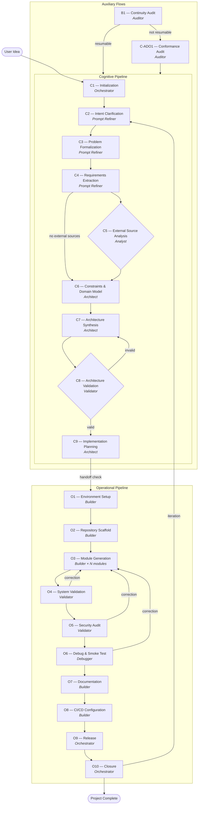

# Software Development Pipeline — How It Works

This document describes how the pipeline transforms an idea into production-ready software, step by step.

---

## Overview

The pipeline is a structured process that takes a user's informal project idea and progressively refines it through two macro-phases:

1. **Cognitive Pipeline** (C1–C9): turns the idea into a complete, validated plan
2. **Operational Pipeline** (O1–O10): executes the plan to produce working software

An **Orchestrator** coordinates the entire process. It never writes code or designs architecture — it delegates each stage to a specialized agent, manages commits, tracks state, and communicates with the user.

All state is stored in a Git repository. A manifest file (`pipeline-state/manifest.json`) tracks which stage the project is in, what artifacts have been produced, and who produced them. If the process is interrupted at any point, it can be resumed from where it stopped.

---

## Pipeline Flow

---

## The Agents

Each agent is a specialist. It receives specific artifacts, does its work, produces output artifacts, and returns control to the orchestrator. Agents never commit to Git or update the manifest — the orchestrator handles all of that.

| Agent | Role | Stages |
|-------|------|--------|
| **Orchestrator** | Coordinates the pipeline, manages state, commits, user communication | C1, O9, O10 |
| **Prompt Refiner** | Transforms a vague idea into precise requirements through dialogue | C2, C3, C4 |
| **Analyst** | Analyzes external code repositories referenced by the project | C5 |
| **Architect** | Designs system architecture, APIs, and implementation plan | C6, C7, C9 |
| **Validator** | Verifies architecture, code quality, and security | C8, O4, O5 |
| **Builder** | Writes code, tests, documentation, and CI/CD configuration | O1, O2, O3, O7, O8 |
| **Debugger** | Runs the application, finds runtime bugs through smoke testing | O6 |
| **Auditor** | Assesses existing repositories for resume or adoption | B1, C-ADO1 |

---

## Cognitive Pipeline — From Idea to Plan

### C1 — Initialization
The orchestrator creates the project repository structure: directories for docs, logs, pipeline state, and archive. It initializes the manifest and makes the first commit. This is the starting point.

### C2 — Intent Clarification
The Prompt Refiner talks with the user to understand what they actually want. It interprets the idea, identifies assumptions, defines terminology, and produces an intent document. The user must confirm the interpretation before moving on.

### C3 — Problem Formalization
The same agent translates the intent into a technical system definition: what the system does, what it receives as input, what it produces as output, and how it behaves at a high level.

### C4 — Requirements Extraction
Requirements are extracted from the problem statement — functional requirements (what the system must do), non-functional requirements (performance, security, etc.), scope boundaries, constraints, and acceptance criteria. Each requirement is numbered for traceability.

### C5 — External Source Analysis *(conditional)*
If the project references external code (libraries, reference implementations), the Analyst clones and inspects them, extracting relevant patterns, configurations, and license information. Skipped if no external sources are referenced.

### C6 — Constraints and Domain Modeling
The Architect identifies all system constraints (performance, security, environment, scalability) and builds a conceptual model of the problem domain — entities, relationships, and operations.

### C7 — Architecture Synthesis
The Architect designs the full system architecture: components, their responsibilities, how they interact, the API surface, configuration model, and interface contracts between components. The user reviews and confirms the architecture.

### C8 — Architecture Validation
The Validator cross-references the architecture against requirements and constraints. If something doesn't match — a requirement has no component, a constraint is violated — the architecture goes back to C7 for revision. This loop continues until the architecture is valid.

### C9 — Implementation Planning
The Architect breaks the architecture into implementable modules: a dependency graph, execution order, per-module specifications, and a test strategy with coverage thresholds. This is the blueprint the Builder will follow.

**Before moving to the operational pipeline**, the orchestrator performs an integrity check to verify all cognitive artifacts are present and consistent.

---

## Operational Pipeline — From Plan to Software

### O1 — Environment Setup
The Builder configures the development environment: runtime versions, dependencies (with lockfile), environment variables, build tools, and recommendations for linters and security scanners.

### O2 — Repository Scaffold
The Builder creates the physical project structure — directories for each module, placeholder files, and configuration files — matching the architecture and module map.

### O3 — Module Generation
This is the core implementation stage. The orchestrator manages a loop: for each module (in dependency order), it invokes the Builder once. The Builder implements the module's code and tests, runs the tests, and produces a per-module report. After all modules are done, a cumulative report is generated.

### O4 — System Validation
The Validator runs the full test suite, performs static analysis, verifies architectural conformance, and checks quality gates (coverage, complexity). It produces a structured report with PASS/FAIL verdicts. The user can request corrections (which loop back to O3) or proceed.

### O5 — Security Audit
The Validator analyzes the code for OWASP Top 10 risks, checks dependencies for known vulnerabilities (CVEs), and verifies security patterns. It documents all findings with severity and recommendations, and explicitly states analysis limitations. Again, the user decides whether corrections are needed.

### O6 — Debug and Smoke Test
The Debugger runs the application in realistic scenarios, captures logs, and looks for bugs that tests didn't catch — edge cases, runtime anomalies, unexpected behavior. It reports findings with reproduction steps and severity. Corrections loop back through O3→O4→O5→O6.

### O7 — Documentation
The Builder generates user-facing documentation: a README, API reference, and installation guide — all derived from the architecture, code, and configuration artifacts.

### O8 — CI/CD Configuration
The Builder sets up continuous integration: workflow files, triggers (push, PR, tag), and pipeline steps (install, lint, test, build), consistent with the test strategy.

### O9 — Release
The orchestrator tags the release with a semantic version, generates a changelog and release notes, and optionally prepares deployment configuration.

### O10 — Closure
The orchestrator verifies repository integrity (all artifacts present, manifest consistent), produces a final report, and presents the user with two choices: **iterate** (re-enter the pipeline at a specific stage) or **close** (mark the project as complete).

---

## Auxiliary Flows

### B1 — Continuity Audit (Resume)
When returning to an interrupted project, the Auditor scans the repository to determine where the pipeline stopped. If the manifest is valid, artifacts are consistent, and the interruption point is clear, the project can be resumed. Otherwise, it's redirected to adoption.

### C-ADO1 — Conformance Audit (Adoption)
For existing projects not built with this pipeline, the Auditor inventories what exists, identifies what's missing, and produces a plan to fill the gaps. The orchestrator then executes that plan by invoking the appropriate agents, after which the project re-enters the main flow.

---

## Key Mechanisms

### User Gates
Certain stages require the user's explicit confirmation before the pipeline moves forward — for example, confirming the interpreted intent (C2), approving the architecture (C7), or deciding whether to correct validation findings (O4/O5/O6). Stages without a user gate transition automatically.

### Correction Loops
When O4, O5, or O6 find issues, the user can request full or selective correction. The pipeline returns to O3 (only for affected modules), then re-runs all validation stages sequentially up to the one that found the issues.

### Re-Entry
From a completed project, the user can re-enter at any stage. Cognitive re-entry (C2–C9) invalidates all operational artifacts. Operational re-entry (O1–O9) preserves cognitive artifacts. Artifacts from invalidated stages are archived, never deleted.

### Commit Conventions
Every action produces a Git commit. The format is `[<stage-id>] <description>` for orchestrator actions, and `[<stage-id>] [<agent-name>] <description>` for stage completions, so the git log clearly shows who produced what.

### Statelessness
All agents are stateless — they have no memory between invocations. Everything they need is in the committed artifacts and the manifest. This means the pipeline can survive interruptions, session changes, and context resets without losing progress.
