# Pipeline Description — Software Development Pipeline v2.0

This document provides a human-readable overview of how the pipeline works, who does what, and how the pieces connect. For the full formal specification, see `pipeline_2.0_en.md`.

---

## What Is This Pipeline?

This pipeline is an **AI-assisted software development system** that transforms a vague project idea into a working, tested, secure, documented, and releasable software product. It is designed for a single user interacting with an **Orchestrator** that coordinates a team of specialized AI agents.

The process is divided into two major phases:

1. **Cognitive Pipeline** — Understand the idea, formalize it, design the architecture
2. **Operational Pipeline** — Build, test, secure, document, and release the software

---

## The Agents

Eight specialized agents participate in the pipeline, each with a focused role:

| Agent | Role | What It Does |
|-------|------|--------------|
| **Orchestrator** | Coordinator | Manages pipeline flow, commits, manifest, progress tracking. Executes C1, O9, O10 directly. Delegates everything else. |
| **Prompt Refiner** | Requirements Specialist | Clarifies intent, formalizes the problem, extracts requirements (C2–C4) |
| **Analyst** | Source Researcher | Analyzes external codebases and architectures (C5) |
| **Architect** | System Designer | Models constraints and domain, designs architecture, plans implementation (C6, C7, C9) |
| **Validator** | Quality Inspector | Validates architecture, tests the system, audits security (C8, O4, O5) |
| **Builder** | Implementation Engineer | Sets up environment, scaffolds project, writes code+tests, docs, CI/CD (O1–O3, O7–O8) |
| **Debugger** | Runtime Tester | Runs the application, smoke tests, captures logs, finds runtime bugs (O6) |
| **Auditor** | Project Analyst | Determines if an existing project can resume or needs adoption (B1, C-ADO1) |

---

## Pipeline Flow — Block Diagram

```mermaid
flowchart TD
    START([User Idea]) --> C1

    subgraph COGNITIVE["Cognitive Pipeline"]
        direction TB
        C1["C1 — Initialization\n(Orchestrator)"]
        C2["C2 — Intent Clarification\n(Prompt Refiner)\n🚪 User Gate"]
        C3["C3 — Problem Formalization\n(Prompt Refiner)\n🚪 User Gate"]
        C4["C4 — Requirements Extraction\n(Prompt Refiner)\n🚪 User Gate"]
        C5{"C5 — External Source Analysis\n(Analyst)\n[conditional]"}
        C6["C6 — Constraints & Domain Model\n(Architect)"]
        C7["C7 — Architecture Synthesis\n(Architect)\n🚪 User Gate"]
        C8{"C8 — Architecture Validation\n(Validator)"}
        C9["C9 — Implementation Planning\n(Architect)\n🚪 User Gate"]

        C1 --> C2 --> C3 --> C4 --> C5
        C5 -->|has sources| C6
        C5 -->|no sources / skip| C6
        C6 --> C7 --> C8
        C8 -->|valid| C9
        C8 -->|invalid| C7
    end

    C9 --> HANDOFF["✅ Handoff Check\n(Orchestrator)"]

    HANDOFF --> O1

    subgraph OPERATIONAL["Operational Pipeline"]
        direction TB
        O1["O1 — Environment Setup\n(Builder)"]
        O2["O2 — Repository Scaffold\n(Builder)"]
        O3["O3 — Module Generation\n(Builder)\nmodule-by-module"]
        O4["O4 — System Validation\n(Validator)\n🚪 User Gate"]
        O5["O5 — Security Audit\n(Validator)\n🚪 User Gate"]
        O6["O6 — Debug & Smoke Test\n(Debugger)\n🚪 User Gate"]
        O7["O7 — Documentation\n(Builder)"]
        O8["O8 — CI/CD Configuration\n(Builder)"]
        O9["O9 — Release & Deployment\n(Orchestrator)\n🚪 User Gate"]
        O10["O10 — Closure & Report\n(Orchestrator)\n🚪 User Gate"]

        O1 --> O2 --> O3 --> O4
        O4 -->|correction| O3
        O4 -->|pass| O5
        O5 -->|correction| O3
        O5 -->|pass| O6
        O6 -->|correction| O3
        O6 -->|pass| O7
        O7 --> O8 --> O9 --> O10
    end

    O10 -->|closure| DONE([Project Complete])
    O10 -->|iterate| REENTRY["Re-Entry\n(R.5 Protocol)"]
    REENTRY --> C2

    subgraph AUXILIARY["Auxiliary Flows"]
        direction TB
        B1["B1 — Continuity Audit\n(Auditor)"]
        CADO1["C-ADO1 — Conformance Audit\n(Auditor)"]

        B1 -->|resumable| RESUME["Re-enter Main Flow"]
        B1 -->|not resumable| CADO1
        CADO1 -->|plan complete| RESUME
    end
```



---

## How It Works — Step by Step

### Phase 1: Cognitive Pipeline (C1–C9)

The goal is to progressively remove ambiguity until you have a complete, validated implementation plan.

**1. Initialization (C1)** — The Orchestrator creates the project structure: directories, manifest, Git repo. This establishes the traceable foundation.

**2. Intent Clarification (C2)** — The Prompt Refiner talks to you to understand what you actually want. It produces `intent.md` capturing your goal, context, assumptions, and terminology. You must confirm.

**3. Problem Formalization (C3)** — The same Prompt Refiner takes your confirmed intent and translates it into a precise technical definition: what the system does, what it takes in, what it produces. You must confirm.

**4. Requirements Extraction (C4)** — One more pass with the Prompt Refiner: your problem definition is decomposed into numbered functional requirements, non-functional requirements, constraints, and acceptance criteria. This produces `project-spec.md`. You must confirm.

**5. External Source Analysis (C5)** — *Conditional*. If your spec references external code (a library to wrap, a system to integrate with), the Analyst inspects those sources and extracts relevant patterns, configurations, and license info. If there are no external sources, this stage is skipped.

**6. Constraints & Domain Modeling (C6)** — The Architect analyzes your requirements to identify constraints (performance, security, environment, scalability) and builds a conceptual domain model (entities, relationships, operations). No user gate here — any errors are caught later by C8.

**7. Architecture Synthesis (C7)** — The Architect designs the full system: component structure, APIs, configuration model, and interface contracts between components. You must confirm the architecture.

**8. Architecture Validation (C8)** — The Validator cross-references the architecture against requirements, constraints, and the domain model. If something doesn't match, it sends the Architect back to C7 with revision notes. If everything checks out, we proceed.

**9. Implementation Planning (C9)** — The Architect decomposes the architecture into tasks with a dependency graph, an execution sequence, a module map, and a test strategy. You must confirm the plan.

**Handoff Check** — Before moving to implementation, the Orchestrator automatically verifies that all cognitive artifacts are present and consistent. If anything is missing, it halts and reports.

### Phase 2: Operational Pipeline (O1–O10)

The plan is executed to produce working software.

**1. Environment Setup (O1)** — The Builder configures the development environment: runtimes, dependencies, lockfile, and recommends external tools for later stages.

**2. Repository Scaffold (O2)** — The Builder creates the physical project structure (directories, placeholder files, config files) based on the module map.

**3. Module Generation (O3)** — The Builder implements code **module by module**, following the dependency graph. For each module: write code, write tests, run tests, commit. If a module fails, you're asked what to do (retry, skip, stop).

**4. System Validation (O4)** — The Validator runs the full test suite, checks architectural conformance, performs static analysis, and verifies quality gates. If issues are found, you choose: fix everything, fix selectively, or accept.

**5. Security Audit (O5)** — The Validator checks for OWASP vulnerabilities, audits dependencies for CVEs, and verifies security patterns. It uses LLM analysis as primary method and external tools if configured. Limitations are explicitly documented.

**6. Debug & Smoke Test (O6)** — The Debugger runs the application in realistic scenarios, captures logs, and hunts for runtime bugs that testing didn't catch. Each bug is documented with reproduction steps and severity.

**7. Documentation (O7)** — The Builder generates README, API reference, and installation guide from the code and architecture docs.

**8. CI/CD Configuration (O8)** — The Builder sets up the automated pipeline (GitHub Actions, GitLab CI, etc.) with install, lint, test, and build steps.

**9. Release & Deployment (O9)** — The Orchestrator tags the release with a semantic version, generates changelog and release notes, and (optionally) prepares deployment configuration.

**10. Closure (O10)** — The Orchestrator verifies repository integrity and produces a final report. You choose: iterate (re-enter the pipeline at a specific point) or close the project.

---

## Correction Loops

Three validation stages (O4, O5, O6) can send you back to O3 for corrections:

```
O4 finds issues → O3 (fix) → O4 (re-validate)
O5 finds issues → O3 (fix) → O4 → O5 (re-validate chain)
O6 finds issues → O3 (fix) → O4 → O5 → O6 (full re-validation)
```

These are **internal loops** — they don't archive anything. The validation reports are simply overwritten on the next pass.

---

## Auxiliary Flows

### Flow B — Project Resume

If a project was previously started with this pipeline and interrupted:

1. **B1 (Continuity Audit)**: the Auditor inspects the repo and manifest to determine if the project can be resumed
2. If **resumable**: the pipeline picks up where it left off
3. If **not resumable**: switches to the Adoption flow

### Flow C — Project Adoption

If a project was NOT built with this pipeline (or its state is corrupted):

1. **C-ADO1 (Conformance Audit)**: the Auditor maps existing artifacts to pipeline stages, identifies gaps, and produces a plan to fill them
2. The Orchestrator executes the plan (invoking agents as needed)
3. Once compliant, the project re-enters the main flow

---

## Key Mechanisms

### User Gates (🚪)

Several stages require your explicit confirmation before proceeding. These ensure:
- The pipeline doesn't drift from your intent
- You're satisfied with intermediate results
- You can redirect if something is wrong

Stages with user gates: **C2, C3, C4, C5, C7, C9, O4, O5, O6, O9, O10**

### Re-Entry Protocol (R.5)

From the COMPLETED state or auxiliary flows, you can re-enter at any previous stage:
- **Cognitive re-entry** (C2–C9): all operational artifacts are archived
- **Operational re-entry** (O1–O9): only artifacts from the re-entry point onward are archived

Archives are never auto-deleted — full history is preserved.

### Escalation Protocol (R.8)

When an agent gets stuck:
1. **Level 1**: asks you a clarifying question (within the current stage)
2. **Level 2**: signals an upstream artifact problem → proposes re-entry
3. **Level 3**: fatal blockage → pipeline stops

### Pipeline State

The state is always tracked in `pipeline-state/manifest.json`. This file records:
- Current state (which stage we're at)
- Progress metrics (stage X of Y, module M of N)
- History of all completed stages with commit hashes
- Re-entry and correction loop history

---

## Traceability

Every action produces a log in `logs/`. Every stage completion triggers a Git commit. The manifest is updated after every commit. This means:
- You can always determine what happened and when
- You can always roll back to any previous state
- The repository is the single source of truth

---

## Git Conventions

| What | Format |
|------|--------|
| Branch | `pipeline/<project-name>` |
| Commits | `[<stage-id>] <description>` |
| Tags | Semantic version (e.g., `v1.0.0`) |
| Merge | To `main` on user confirmation |

---

## Artifact Map

The pipeline produces these artifacts across all stages:

| Stage | Artifacts |
|-------|-----------|
| C1 | `pipeline-state/manifest.json`, `logs/session-init-1.md` |
| C2 | `docs/intent.md` |
| C3 | `docs/problem-statement.md` |
| C4 | `docs/project-spec.md` |
| C5 | `docs/upstream-analysis.md` *(conditional)* |
| C6 | `docs/constraints.md`, `docs/domain-model.md` |
| C7 | `docs/architecture.md`, `docs/api.md`, `docs/configuration.md`, `docs/interface-contracts.md` |
| C8 | `docs/architecture-review.md` |
| C9 | `docs/task-graph.md`, `docs/implementation-plan.md`, `docs/module-map.md`, `docs/test-strategy.md` |
| O1 | `docs/environment.md`, config files |
| O2 | `docs/repository-structure.md`, project directories |
| O3 | `src/*/`, `tests/*/`, per-module reports |
| O4 | `docs/validator-report.md` |
| O5 | `docs/security-audit-report.md` |
| O6 | `docs/debugger-report.md`, `logs/runtime-logs/` |
| O7 | `README.md`, `docs/api-reference.md`, `docs/installation-guide.md` |
| O8 | CI/CD config files, `docs/cicd-configuration.md` |
| O9 | Git tag, `CHANGELOG.md`, `docs/release-notes.md` |
| O10 | `docs/final-report.md` |

---

*For the formal specification with all validation criteria, state machine, and manifest schema, see `pipeline_2.0_en.md`.*
