# Descrizione della Pipeline — Pipeline di Sviluppo Software v2.0

Questo documento fornisce una panoramica leggibile di come funziona la pipeline, chi fa cosa e come si collegano i vari elementi. Per la specifica formale completa, vedi `pipeline_2.0_it.md`.

---

## Cos'è Questa Pipeline?

Questa pipeline è un **sistema di sviluppo software assistito da IA** che trasforma un'idea di progetto vaga in un prodotto software funzionante, testato, sicuro, documentato e rilasciabile. È progettata per un singolo utente che interagisce con un **Orchestratore** che coordina un team di agenti IA specializzati.

Il processo è diviso in due fasi principali:

1. **Pipeline Cognitiva** — Comprendere l'idea, formalizzarla, progettare l'architettura
2. **Pipeline Operativa** — Costruire, testare, rendere sicuro, documentare e rilasciare il software

---

## Gli Agenti

Otto agenti specializzati partecipano alla pipeline, ciascuno con un ruolo specifico:

| Agente | Ruolo | Cosa Fa |
|--------|-------|---------|
| **Orchestratore** | Coordinatore | Gestisce il flusso della pipeline, i commit, il manifesto, il tracciamento del progresso. Esegue C1, O9, O10 direttamente. Delega tutto il resto. |
| **Prompt Refiner** | Specialista Requisiti | Chiarisce l'intento, formalizza il problema, estrae i requisiti (C2–C4) |
| **Analista** | Ricercatore Sorgenti | Analizza codebase e architetture esterne (C5) |
| **Architetto** | Progettista di Sistema | Modella vincoli e dominio, progetta l'architettura, pianifica l'implementazione (C6, C7, C9) |
| **Validatore** | Ispettore Qualità | Valida l'architettura, testa il sistema, verifica la sicurezza (C8, O4, O5) |
| **Builder** | Ingegnere di Implementazione | Configura l'ambiente, crea lo scaffold del progetto, scrive codice+test, documentazione, CI/CD (O1–O3, O7–O8) |
| **Debugger** | Tester Runtime | Esegue l'applicazione, smoke test, cattura log, trova bug runtime (O6) |
| **Auditor** | Analista di Progetto | Determina se un progetto esistente può essere ripreso o necessita di adozione (B1, C-ADO1) |

---

## Flusso della Pipeline — Diagramma a Blocchi

```mermaid
flowchart TD
    START([Idea Utente]) --> C1

    subgraph COGNITIVE["Pipeline Cognitiva"]
        direction TB
        C1["C1 — Inizializzazione\n(Orchestratore)"]
        C2["C2 — Chiarimento Intento\n(Prompt Refiner)\n🚪 Gate Utente"]
        C3["C3 — Formalizzazione Problema\n(Prompt Refiner)\n🚪 Gate Utente"]
        C4["C4 — Estrazione Requisiti\n(Prompt Refiner)\n🚪 Gate Utente"]
        C5{"C5 — Analisi Sorgenti Esterne\n(Analista)\n[condizionale]"}
        C6["C6 — Vincoli e Modello Dominio\n(Architetto)"]
        C7["C7 — Sintesi Architettura\n(Architetto)\n🚪 Gate Utente"]
        C8{"C8 — Validazione Architettura\n(Validatore)"}
        C9["C9 — Pianificazione Implementazione\n(Architetto)\n🚪 Gate Utente"]

        C1 --> C2 --> C3 --> C4 --> C5
        C5 -->|ha sorgenti| C6
        C5 -->|nessuna sorgente / skip| C6
        C6 --> C7 --> C8
        C8 -->|valida| C9
        C8 -->|invalida| C7
    end

    C9 --> HANDOFF["✅ Controllo Handoff\n(Orchestratore)"]

    HANDOFF --> O1

    subgraph OPERATIONAL["Pipeline Operativa"]
        direction TB
        O1["O1 — Setup Ambiente\n(Builder)"]
        O2["O2 — Scaffold Repository\n(Builder)"]
        O3["O3 — Generazione Moduli\n(Builder)\nmodulo per modulo"]
        O4["O4 — Validazione Sistema\n(Validatore)\n🚪 Gate Utente"]
        O5["O5 — Audit Sicurezza\n(Validatore)\n🚪 Gate Utente"]
        O6["O6 — Debug e Smoke Test\n(Debugger)\n🚪 Gate Utente"]
        O7["O7 — Documentazione\n(Builder)"]
        O8["O8 — Configurazione CI/CD\n(Builder)"]
        O9["O9 — Rilascio e Deployment\n(Orchestratore)\n🚪 Gate Utente"]
        O10["O10 — Chiusura e Report\n(Orchestratore)\n🚪 Gate Utente"]

        O1 --> O2 --> O3 --> O4
        O4 -->|correzione| O3
        O4 -->|pass| O5
        O5 -->|correzione| O3
        O5 -->|pass| O6
        O6 -->|correzione| O3
        O6 -->|pass| O7
        O7 --> O8 --> O9 --> O10
    end

    O10 -->|chiusura| DONE([Progetto Completato])
    O10 -->|iterazione| REENTRY["Rientro\n(Protocollo R.5)"]
    REENTRY --> C2

    subgraph AUXILIARY["Flussi Ausiliari"]
        direction TB
        B1["B1 — Audit di Continuità\n(Auditor)"]
        CADO1["C-ADO1 — Audit di Conformità\n(Auditor)"]

        B1 -->|ripristinabile| RESUME["Rientro Flusso Principale"]
        B1 -->|non ripristinabile| CADO1
        CADO1 -->|piano completato| RESUME
    end
```



---

## Come Funziona — Passo per Passo

### Fase 1: Pipeline Cognitiva (C1–C9)

L'obiettivo è rimuovere progressivamente l'ambiguità fino ad avere un piano di implementazione completo e validato.

**1. Inizializzazione (C1)** — L'Orchestratore crea la struttura del progetto: directory, manifesto, repository Git. Questo stabilisce la base tracciabile.

**2. Chiarimento dell'Intento (C2)** — Il Prompt Refiner dialoga con te per capire cosa vuoi realmente. Produce `intent.md` che cattura il tuo obiettivo, contesto, assunzioni e terminologia. Devi confermare.

**3. Formalizzazione del Problema (C3)** — Lo stesso Prompt Refiner prende il tuo intento confermato e lo traduce in una definizione tecnica precisa: cosa fa il sistema, cosa riceve in input, cosa produce. Devi confermare.

**4. Estrazione dei Requisiti (C4)** — Un ulteriore passaggio con il Prompt Refiner: la definizione del problema viene decomposta in requisiti funzionali numerati, requisiti non funzionali, vincoli e criteri di accettazione. Produce `project-spec.md`. Devi confermare.

**5. Analisi Sorgenti Esterne (C5)** — *Condizionale*. Se la specifica fa riferimento a codice esterno (una libreria da wrappare, un sistema con cui integrarsi), l'Analista ispeziona quelle sorgenti ed estrae pattern, configurazioni e informazioni di licenza rilevanti. Se non ci sono sorgenti esterne, questo stadio viene saltato.

**6. Vincoli e Modellazione Dominio (C6)** — L'Architetto analizza i requisiti per identificare vincoli (prestazioni, sicurezza, ambiente, scalabilità) e costruisce un modello concettuale del dominio (entità, relazioni, operazioni). Nessun gate utente qui — eventuali errori vengono intercettati successivamente da C8.

**7. Sintesi dell'Architettura (C7)** — L'Architetto progetta l'intero sistema: struttura dei componenti, API, modello di configurazione e contratti di interfaccia tra componenti. Devi confermare l'architettura.

**8. Validazione dell'Architettura (C8)** — Il Validatore effettua un cross-referencing dell'architettura rispetto a requisiti, vincoli e modello di dominio. Se qualcosa non corrisponde, rimanda l'Architetto a C7 con note di revisione. Se tutto è conforme, si procede.

**9. Pianificazione dell'Implementazione (C9)** — L'Architetto decompone l'architettura in task con un grafo delle dipendenze, una sequenza di esecuzione, una mappa dei moduli e una strategia di test. Devi confermare il piano.

**Controllo Handoff** — Prima di passare all'implementazione, l'Orchestratore verifica automaticamente che tutti gli artefatti cognitivi siano presenti e consistenti. Se manca qualcosa, si ferma e segnala.

### Fase 2: Pipeline Operativa (O1–O10)

Il piano viene eseguito per produrre software funzionante.

**1. Setup Ambiente (O1)** — Il Builder configura l'ambiente di sviluppo: runtime, dipendenze, lockfile e raccomanda strumenti esterni per gli stadi successivi.

**2. Scaffold del Repository (O2)** — Il Builder crea la struttura fisica del progetto (directory, file placeholder, file di configurazione) basandosi sulla mappa dei moduli.

**3. Generazione Moduli (O3)** — Il Builder implementa il codice **modulo per modulo**, seguendo il grafo delle dipendenze. Per ogni modulo: scrive il codice, scrive i test, esegue i test, committa. Se un modulo fallisce, ti viene chiesto cosa fare (riprova, salta, ferma).

**4. Validazione del Sistema (O4)** — Il Validatore esegue l'intera suite di test, verifica la conformità architetturale, effettua analisi statica e verifica i gate di qualità. Se vengono trovati problemi, scegli: correggi tutto, correggi selettivamente, o accetta.

**5. Audit di Sicurezza (O5)** — Il Validatore controlla vulnerabilità OWASP, verifica le dipendenze per CVE e controlla i pattern di sicurezza. Usa l'analisi LLM come metodo primario e strumenti esterni se configurati. Le limitazioni sono documentate esplicitamente.

**6. Debug e Smoke Test (O6)** — Il Debugger esegue l'applicazione in scenari realistici, cattura log e cerca bug runtime che i test non hanno intercettato. Ogni bug è documentato con passi di riproduzione e severità.

**7. Documentazione (O7)** — Il Builder genera README, riferimento API e guida all'installazione dal codice e dalla documentazione architetturale.

**8. Configurazione CI/CD (O8)** — Il Builder configura la pipeline automatizzata (GitHub Actions, GitLab CI, ecc.) con i passaggi di install, lint, test e build.

**9. Rilascio e Deployment (O9)** — L'Orchestratore tagga il rilascio con una versione semantica, genera changelog e note di rilascio e (opzionalmente) prepara la configurazione di deployment.

**10. Chiusura (O10)** — L'Orchestratore verifica l'integrità del repository e produce un report finale. Puoi scegliere: iterare (rientrare nella pipeline in un punto specifico) o chiudere il progetto.

---

## Loop di Correzione

Tre stadi di validazione (O4, O5, O6) possono rimandarti a O3 per correzioni:

```
O4 trova problemi → O3 (correggi) → O4 (ri-valida)
O5 trova problemi → O3 (correggi) → O4 → O5 (catena di ri-validazione)
O6 trova problemi → O3 (correggi) → O4 → O5 → O6 (ri-validazione completa)
```

Questi sono **loop interni** — non archiviano nulla. I report di validazione vengono semplicemente sovrascritti al passaggio successivo.

---

## Flussi Ausiliari

### Flusso B — Ripresa Progetto

Se un progetto è stato precedentemente avviato con questa pipeline e interrotto:

1. **B1 (Audit di Continuità)**: l'Auditor ispeziona il repository e il manifesto per determinare se il progetto può essere ripreso
2. Se **ripristinabile**: la pipeline riprende da dove si era interrotta
3. Se **non ripristinabile**: passa al flusso di Adozione

### Flusso C — Adozione Progetto

Se un progetto NON è stato costruito con questa pipeline (o il suo stato è corrotto):

1. **C-ADO1 (Audit di Conformità)**: l'Auditor mappa gli artefatti esistenti sugli stadi della pipeline, identifica i gap e produce un piano per colmarli
2. L'Orchestratore esegue il piano (invocando gli agenti necessari)
3. Una volta conforme, il progetto rientra nel flusso principale

---

## Meccanismi Chiave

### Gate Utente (🚪)

Diversi stadi richiedono la tua conferma esplicita prima di procedere. Questo garantisce:
- La pipeline non si allontana dal tuo intento
- Sei soddisfatto dei risultati intermedi
- Puoi redirezionare se qualcosa non va

Stadi con gate utente: **C2, C3, C4, C5, C7, C9, O4, O5, O6, O9, O10**

### Protocollo di Rientro (R.5)

Dallo stato COMPLETED o dai flussi ausiliari, puoi rientrare in qualsiasi stadio precedente:
- **Rientro cognitivo** (C2–C9): tutti gli artefatti operativi vengono archiviati
- **Rientro operativo** (O1–O9): solo gli artefatti dal punto di rientro in avanti vengono archiviati

Gli archivi non vengono mai cancellati automaticamente — lo storico completo è preservato.

### Protocollo di Escalation (R.8)

Quando un agente si blocca:
1. **Livello 1**: ti pone una domanda di chiarimento (nello stadio corrente)
2. **Livello 2**: segnala un problema in un artefatto upstream → propone il rientro
3. **Livello 3**: blocco fatale → la pipeline si ferma

### Stato della Pipeline

Lo stato è sempre tracciato in `pipeline-state/manifest.json`. Questo file registra:
- Stato corrente (in quale stadio ci troviamo)
- Metriche di progresso (stadio X di Y, modulo M di N)
- Storico di tutti gli stadi completati con hash dei commit
- Storico dei rientri e dei loop di correzione

---

## Tracciabilità

Ogni azione produce un log in `logs/`. Ogni completamento di stadio attiva un commit Git. Il manifesto viene aggiornato dopo ogni commit. Questo significa:
- Puoi sempre determinare cosa è successo e quando
- Puoi sempre tornare a qualsiasi stato precedente
- Il repository è l'unica fonte di verità

---

## Convenzioni Git

| Cosa | Formato |
|------|---------|
| Branch | `pipeline/<nome-progetto>` |
| Commit | `[<stage-id>] <descrizione>` |
| Tag | Versione semantica (es. `v1.0.0`) |
| Merge | Su `main` alla conferma dell'utente |

---

## Mappa degli Artefatti

La pipeline produce questi artefatti attraverso tutti gli stadi:

| Stadio | Artefatti |
|--------|-----------|
| C1 | `pipeline-state/manifest.json`, `logs/session-init-1.md` |
| C2 | `docs/intent.md` |
| C3 | `docs/problem-statement.md` |
| C4 | `docs/project-spec.md` |
| C5 | `docs/upstream-analysis.md` *(condizionale)* |
| C6 | `docs/constraints.md`, `docs/domain-model.md` |
| C7 | `docs/architecture.md`, `docs/api.md`, `docs/configuration.md`, `docs/interface-contracts.md` |
| C8 | `docs/architecture-review.md` |
| C9 | `docs/task-graph.md`, `docs/implementation-plan.md`, `docs/module-map.md`, `docs/test-strategy.md` |
| O1 | `docs/environment.md`, file di configurazione |
| O2 | `docs/repository-structure.md`, directory del progetto |
| O3 | `src/*/`, `tests/*/`, report per modulo |
| O4 | `docs/validator-report.md` |
| O5 | `docs/security-audit-report.md` |
| O6 | `docs/debugger-report.md`, `logs/runtime-logs/` |
| O7 | `README.md`, `docs/api-reference.md`, `docs/installation-guide.md` |
| O8 | File di configurazione CI/CD, `docs/cicd-configuration.md` |
| O9 | Tag Git, `CHANGELOG.md`, `docs/release-notes.md` |
| O10 | `docs/final-report.md` |

---

*Per la specifica formale con tutti i criteri di validazione, la macchina a stati e lo schema del manifesto, vedi `pipeline_2.0_it.md`.*
