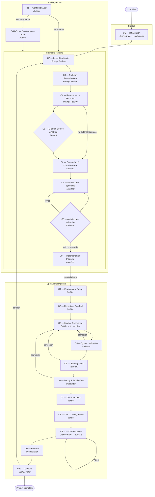

# Software Development Pipeline — How It Works

This document describes how the pipeline transforms an idea into production-ready software, step by step.

---

## Overview

The pipeline is a structured process that takes a user's informal project idea and progressively refines it through two macro-phases:

1. **Cognitive Pipeline** (C2–C9): turns the idea into a complete, validated plan
2. **Operational Pipeline** (O1–O10): executes the plan to produce working software

An **Orchestrator** coordinates the entire process. It never writes code or designs architecture — it delegates each stage to a specialized agent, manages commits, tracks state, and communicates with the user. Before the first stage (C2), the orchestrator runs a startup procedure (C1) to set up the repository infrastructure.

All state is stored in a Git repository. The pipeline state is split across two manifest files: `pipeline-state/manifest.json` (HEAD — current state, latest stage data, <5 KB) and `pipeline-state/manifest-history.json` (HISTORY — append-only log of all stage executions, re-entries, and corrections). The HEAD manifest tracks which stage the project is in and what artifacts were most recently produced. If the process is interrupted at any point, it can be resumed from where it stopped.

---

## Pipeline Flow

---

## The Agents

Each agent is a specialist. It receives specific artifacts, does its work, produces output artifacts, and returns control to the orchestrator. Agents never commit to Git or update the manifest — the orchestrator handles all of that.

| Agent | Role | Stages |
|-------|------|--------|
| **Orchestrator** | Coordinates the pipeline, manages state, commits, user communication | C1 (startup), O8.V, O9, O10 |
| **Prompt Refiner** | Transforms a vague idea into precise requirements through dialogue | C2, C3, C4 |
| **Analyst** | Analyzes external code repositories referenced by the project | C5 |
| **Architect** | Designs system architecture, APIs, and implementation plan | C6, C7, C9 |
| **Validator** | Verifies architecture, code quality, and security | C8, O4, O5 |
| **Builder** | Writes code, tests, documentation, and CI/CD configuration | O1, O2, O3, O7, O8, O8.V (fixes) |
| **Debugger** | Runs the application, finds runtime bugs through smoke testing | O6 |
| **Auditor** | Assesses existing repositories for resume or adoption | B1, C-ADO1 |

---

## Cognitive Pipeline — From Idea to Plan

### C1 — Initialization *(startup procedure)*
The orchestrator creates the working branch (`pipeline/<project-name>`) and the project repository structure: directories for docs, logs, pipeline state, and archive. It initializes both manifest files (HEAD and HISTORY) and makes the first commit. This is not a numbered pipeline stage — it happens automatically before C2.

### C2 — Intent Clarification
The Prompt Refiner talks with the user to understand what they actually want. It interprets the idea, identifies assumptions, defines terminology, and produces an intent document. The user must confirm the interpretation before moving on.

### C3 — Problem Formalization
The same agent translates the intent into a technical system definition: what the system does, what it receives as input, what it produces as output, and how it behaves at a high level.

### C4 — Requirements Extraction
Requirements are extracted from the problem statement — functional requirements (what the system must do), non-functional requirements (performance, security, etc.), scope boundaries, constraints, and acceptance criteria. Each requirement is numbered for traceability.

### C5 — External Source Analysis *(conditional)*
If the project references external code (libraries, reference implementations), the Analyst clones and inspects them, extracting relevant patterns, configurations, and license information. Skipped if no external sources are referenced.

### C6 — Constraints and Domain Modeling
The Architect identifies all system constraints (performance, security, environment, scalability) and builds a conceptual model of the problem domain — entities, relationships, and operations.

### C7 — Architecture Synthesis
The Architect designs the full system architecture: components, their responsibilities, how they interact, the API surface, configuration model, and interface contracts between components. The user reviews and confirms the architecture.

### C8 — Architecture Validation
The Validator cross-references the architecture against requirements and constraints. The orchestrator then presents the user with three options: proceed (architecture is valid), revise (send back to C7 with notes), or override (proceed despite issues). This gives the user explicit control over the validation outcome.

### C9 — Implementation Planning
The Architect breaks the architecture into implementable modules: a dependency graph, execution order, per-module specifications, and a test strategy with coverage thresholds. This is the blueprint the Builder will follow.

**Before moving to the operational pipeline**, the orchestrator performs an integrity check to verify all cognitive artifacts are present and consistent.

---

## Operational Pipeline — From Plan to Software

### O1 — Environment Setup
The Builder configures the development environment: runtime versions, dependencies (with lockfile), environment variables, build tools, and recommendations for linters and security scanners.

### O2 — Repository Scaffold
The Builder creates the physical project structure — directories for each module, placeholder files, and configuration files — matching the architecture and module map.

### O3 — Module Generation
This is the core implementation stage. The orchestrator manages a loop: for each module (in dependency order), it invokes the Builder once. The Builder implements the module's code and tests, runs the tests, and produces a per-module report. After all modules are done, a cumulative report is generated.

### O4 — System Validation
The Validator runs the full test suite, performs static analysis, verifies architectural conformance, and checks quality gates (coverage, complexity). It produces a structured report with PASS/FAIL verdicts. The user can request corrections (which loop back to O3) or proceed.

### O5 — Security Audit
The Validator analyzes the code for OWASP Top 10 risks, checks dependencies for known vulnerabilities (CVEs), and verifies security patterns. It documents all findings with severity and recommendations, and explicitly states analysis limitations. Again, the user decides whether corrections are needed.

### O6 — Debug and Smoke Test
The Debugger runs the application in realistic scenarios, captures logs, and looks for bugs that tests didn't catch — edge cases, runtime anomalies, unexpected behavior. It reports findings with reproduction steps and severity. Corrections loop back through O3→O4→O5→O6.

### O7 — Documentation
The Builder generates user-facing documentation: a README, API reference, and installation guide — all derived from the architecture, code, and configuration artifacts.

### O8 — CI/CD Configuration
The Builder sets up continuous integration: workflow files, triggers (push, PR, tag), and pipeline steps (install, lint, test, build), consistent with the test strategy.

### O8.V — CI Verification
The orchestrator triggers the CI workflow on GitHub using `gh` CLI and monitors the result. If the workflow passes, the pipeline proceeds. If it fails, the orchestrator collects the raw failure log and passes it to the Builder, who analyzes the error, classifies it, applies a fix, and returns a structured report. The orchestrator uses the report for routing: commit the fix and re-trigger CI, wait and retry for infrastructure issues, or escalate if the fix is too significant for an in-place correction. This loop repeats until CI is green. Escalation means requesting user re-entry in normal mode, or performing automatic re-entry in automode. GitHub CLI (`gh`) is a mandatory pipeline requirement established during O1.

### O9 — Release
The orchestrator tags the release with a semantic version, generates a changelog and release notes, and optionally prepares deployment configuration.

### O10 — Closure
The orchestrator verifies repository integrity (all artifacts present, manifest consistent), produces a final report, and presents the user with two choices: **iterate** (re-enter the pipeline at a specific stage) or **close** (mark the project as complete).

---

## Auxiliary Flows

### B1 — Continuity Audit (Resume)
When returning to an interrupted project, the Auditor scans the repository to determine where the pipeline stopped. If the manifest is valid, artifacts are consistent, and the interruption point is clear, the project can be resumed. Otherwise, it's redirected to adoption.

### C-ADO1 — Conformance Audit (Adoption)
For existing projects not built with this pipeline, the Auditor inventories what exists, identifies what's missing, and produces a plan to fill the gaps. The orchestrator then executes that plan by invoking the appropriate agents, after which the project re-enters the main flow.

---

## Key Mechanisms

### Entry Preflight
Before any entry flow (new start after C1, resume via B1, adoption via C-ADO1, re-entry via R.5, and before O8.V), the orchestrator runs a runtime/tooling preflight. It verifies baseline CLI availability (`git`, and `gh` when CI verification is in path), repository readiness, and declared runtime/tooling availability from `docs/environment.md` when present. Results are written to `docs/runtime-preflight.md` and `logs/orchestrator-preflight-<N>.md` with decision `PASS`, `WARN`, or `BLOCKED`. `BLOCKED` always stops progression until user intervention, even in automode.

### User Gates
Certain stages require the user's explicit confirmation before the pipeline moves forward — for example, confirming the interpreted intent (C2), approving the architecture (C7), deciding the outcome of architecture validation (C8), or deciding whether to correct validation findings (O4/O5/O6). All user gate definitions are centralized in the orchestrator's Stage Routing Table. Stages without a user gate transition automatically. In automode, user gates are auto-proceeded except C2, which always remains manual.

For C2 specifically, the gate is a mandatory interactive loop: Prompt Refiner may return `NEEDS_CLARIFICATION` multiple times with numbered open questions. The orchestrator collects user answers and re-runs C2 until `READY_FOR_CONFIRMATION`, then awaits explicit user confirmation before exiting C2.

### Correction Loops
When O4, O5, or O6 find issues, the user can request full or selective correction. The pipeline returns to O3 (only for affected modules), then re-runs all validation stages sequentially up to the one that found the issues. Each re-traversed stage is delegated to its assigned agent — the orchestrator never executes these stages itself.

### Re-Entry
From a completed project, the user can re-enter at any stage. Cognitive re-entry (C2–C9) invalidates all operational artifacts. Operational re-entry (O1–O9) preserves cognitive artifacts. Artifacts from invalidated stages are archived, never deleted. Re-entry targeting C2 forces `automode=false` before resuming so clarification remains fully interactive. For focused changes that don't require architectural modifications, Fast Track mode offers a shortened path (see below).

### Context Compaction
The orchestrator emits structured **Pipeline Checkpoint** blocks at compaction breakpoints so context can be compressed without losing routing-critical state. The canonical breakpoints are: post-C9 (cognitive→operational handoff), post-O3 when many modules were generated, post-O10 (pipeline completion), and post-reentry immediately after archival. In OpenCode, compaction is plugin-driven and requires the compaction controller plugin for autonomous execution after checkpoint emission; manual compaction remains a fallback if the plugin is unavailable.

### Commit Conventions
Every action produces a Git commit. The format is `[<stage-id>] <description>` for orchestrator actions, and `[<stage-id>] [<agent-name>] <description>` for stage completions, so the git log clearly shows who produced what.

### Statelessness
All agents are stateless — they have no memory between invocations. Everything they need is in the committed artifacts and the manifest files. This means the pipeline can survive interruptions, session changes, and context resets without losing progress.

### Automode
After the requirements phase (C4), the user can activate automode. In this mode, the orchestrator drives the pipeline autonomously with a mandatory policy: every issue found at every stage must be resolved (always "full correction"). User gates are auto-proceeded except C2 (Intent Clarification), which always requires explicit user confirmation. At O10 (Closure), automode auto-proceeds to closure — completing the merge, tag, and branch cleanup automatically — then presents the Re-Entry Guide so the user can see available options from `COMPLETED` state. The orchestrator handles escalations autonomously too; hard stops remain possible on fatal blockage (R.8 Level 3) and on preflight `BLOCKED` conditions. Automode can be turned off at any time.

### Fast Track
For interventions on completed projects that don't change the architecture or requirements (bug fixes, dependency updates, documentation tweaks), the orchestrator can propose Fast Track mode. This provides a shortened path: only the affected modules are re-implemented (O3), system validation (O4) is always executed, and other stages are included or skipped based on the nature of the change. O4 acts as a safety net — if it finds architectural issues, Fast Track is automatically cancelled and the full pipeline path is restored.
